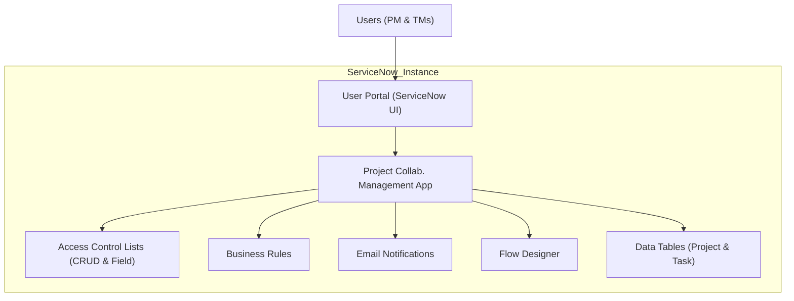
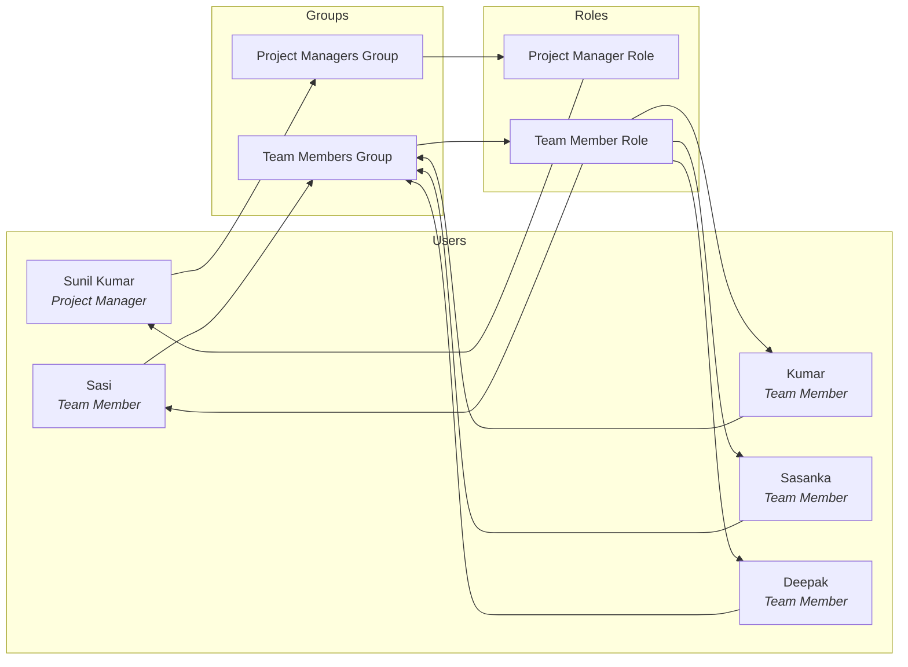

# Project Collaboration Management – ServiceNow RBAC Implementation

**Executive Summary:**  
This repository contains a complete **Project Collaboration Management** application built on ServiceNow, showcasing a structured Role-Based Access Control (RBAC) design. The solution includes custom tables (`Project` and `Project Task`), **Users**, **Groups**, **Roles**, comprehensive **ACL (Access Control List)** rules (both CRUD and field-level), **Business Rules**, **Email Notifications**, and a **Flow Designer** automation. The goal is to allow a *Project Manager* (Sunil Kumar) to oversee project tasks, while *Team Members* (Sasi, Kumar, Sasanka, Deepak) can work on tasks assigned to them—each with appropriate permissions. The repository also includes test cases, architecture diagrams, and deployment notes to guide setup and verification.

- **Project Manager:** Sunil Kumar  
- **Team Members:** Sasi, Kumar, Sasanka, Deepak  
- **Roles:** Project Manager, Team Member  
- **Groups:** Project Managers, Team Members  

<!-- PROJECT STRUCTURE -->
## 🗂️ Folder Structure

```
ProjectCollabManagement/
│   README.md                     (Project overview, structure, RBAC design)
│
├── architecture/                 (Diagrams and design)
│   ├── architecture_diagram.md   (Overall system architecture in Mermaid)
│   └── rbac_diagram.md          (User-Group-Role diagram in Mermaid)
│
├── users/
│   └── Users.md                 (User list with roles/groups)
│
├── groups/
│   └── Groups.md                (Group definitions and role mappings)
│
├── roles/
│   └── Roles.md                 (Role definitions and permissions)
│
├── tables/
│   ├── Project_Table.md         (Project table schema and fields)
│   ├── Project_Task_Table.md    (Project Task table schema and fields)
│   └── Dictionary_Fields.md     (Key dictionary entries and fields)
│
├── acls/
│   ├── CRUD_ACLs/
│   │     └── CRUD_ACLs.md       (Create/Read/Update/Delete ACL rules)
│   ├── Field_ACLs/
│   │     └── Field_ACLs.md      (Field-level ACL rules)
│   └── ACL_Matrix.md            (Permission matrix for roles)
│
├── business_rules/
│   ├── 01_Auto_Close_Completed_Task/
│   │     ├── README.md          (Auto-close tasks when marked completed)
│   │     └── script.js          (Business Rule script placeholder)
│   ├── 02_Update_Project_Completion/
│   │     ├── README.md          (Update project percent complete)
│   │     └── script.js          (Business Rule script placeholder)
│   ├── 03_Update_Project_Status/
│   │     ├── README.md          (Update project status on task changes)
│   │     └── script.js          (Business Rule script placeholder)
│   ├── 04_Lock_Completed_Tasks/
│   │     ├── README.md          (Lock fields on closed tasks)
│   │     └── script.js          (Business Rule script placeholder)
│   └── Summary.md               (Summary of all Business Rules)
│
├── notifications/
│   └── Task_Assigned.md         (Email notification template for task assignment)
│
├── flows/
│   ├── Flow_Designer.md        (Flow Designer configuration notes)
│   └── Flow_Diagram.md         (Workflow diagram in Mermaid)
│
├── testing/
│   ├── PM_Test_Cases.md        (Project Manager test scenarios & results)
│   ├── TM_Test_Cases.md        (Team Member test scenarios & results)
│   ├── ACL_Testing.md          (Access control testing report)
│   ├── Business_Rule_Testing.md(Validation of business rules)
│   └── Notification_Testing.md (Email notification testing)
│
└── update_set/
    └── Update_Set.md           (Deployment/Update Set instructions)
```

---

## 📖 README.md (Project Overview)

### Project Title  
**Project Collaboration Management**

### Short Description  
A ServiceNow application implementing project task management with strict RBAC. It demonstrates how to **manage user roles, groups, and permissions** to ensure that a Project Manager (Sunil Kumar) controls projects and tasks, while Team Members (Sasi, Kumar, Sasanka, Deepak) work on their assigned tasks. This implementation uses **ACLs, Business Rules, Notifications,** and **Flow Designer** to automate processes and secure data.

### Overview  
- **RBAC Model:** Two roles (*Project Manager* and *Team Member*) and corresponding groups (*Project Managers*, *Team Members*) govern access.  
- **Users:** Sunil Kumar (PM) can create/assign tasks. Team Members can update only their tasks.  
- **Tables:** Custom `Project` and `Project Task` tables track projects and associated tasks.  
- **ACLs:** Record-level ACLs enforce CRUD permissions by role, and field ACLs lock sensitive fields.  
- **Business Rules:** Automate task lifecycle (auto-close, status updates, project completion calculation, locking fields).  
- **Notifications:** Email notification “**Task Assigned**” triggers when the PM assigns a task.  
- **Flow:** A Flow Designer workflow orchestrates task assignment and status changes.  
- **Testing:** Detailed test cases validate PM/TM access and rule enforcement.

### System Architecture (Mermaid)



This diagram shows that all users interact via the ServiceNow UI. The custom application (`ProjectApp`) enforces **ACLs** and triggers **Business Rules**, **Notifications**, and **Flows**. Data is stored in the `Project` and `Project Task` tables.

### RBAC Design (Mermaid)



Sunil Kumar is a member of the **Project Managers** group (assigned the *Project Manager* role). All other users (Sasi, Kumar, Sasanka, Deepak) belong to the **Team Members** group (assigned the *Team Member* role). The role assignments drive ACL permissions in the tables.

### Project Structure

The application is organized into logical modules:

- **Tables:** Defines `Project` and `Project Task` tables (see *tables/* directory).  
- **Security (ACLs):** CRUD rules and field ACLs are under *acls/*, with a summary matrix.  
- **Business Rules:** Found under *business_rules/*. Each rule folder has a README and a script placeholder.  
- **Notifications:** Email templates in *notifications/*.  
- **Flows:** Flow Designer notes in *flows/*.  
- **Users/Groups/Roles:** Described in *users/*.md, *groups/*.md, *roles/*.md.  
- **Testing:** Test cases and results in *testing/*.  
- **Deployment:** Update set guidance in *update_set/*.  

### Users, Groups, and Roles

#### Users

| Name         | Role            | Group                | Notes                        |
|--------------|-----------------|----------------------|------------------------------|
| Sunil Kumar  | Project Manager | Project Managers     | Leads projects and assigns tasks. |
| Sasi         | Team Member     | Team Members         | Works on assigned tasks.     |
| Kumar        | Team Member     | Team Members         | Works on assigned tasks.     |
| Sasanka      | Team Member     | Team Members         | Works on assigned tasks.     |
| Deepak       | Team Member     | Team Members         | Works on assigned tasks.     |

Each user has a clearly defined role and is placed into one group.

#### Groups

| Group Name           | Members             | Assigned Role       |
|----------------------|---------------------|---------------------|
| Project Managers     | Sunil Kumar        | Project Manager     |
| Team Members         | Sasi, Kumar, Sasanka, Deepak | Team Member        |

Groups aggregate users and are mapped to roles. E.g., the *Project Managers* group has the *Project Manager* role.

#### Roles

| Role             | Description                                    | Permissions                         |
|------------------|------------------------------------------------|-------------------------------------|
| Project Manager  | Full administrative privileges on projects and tasks. | Can create/read/update/delete all projects and tasks; assign tasks. |
| Team Member      | Limited to tasks assigned to them.             | Can read all tasks; create/update only assigned tasks; cannot delete tasks or modify projects. |

### Project and Task Tables

#### Project Table

- **Table Name:** *u_project*  
- **Key Fields:** `Number` (Auto generated ID), `Name`, `Description`, `Start Date`, `End Date`, `Status` (e.g. Active/Completed), `Percent Complete` (calculated).  

This table stores projects. Only the Project Manager can create/edit projects.

#### Project Task Table

- **Table Name:** *u_project_task*  
- **Key Fields:** `Number` (Auto ID), `Project` (Reference to Project), `Short Description`, `Description`, `Assigned To` (User), `State` (e.g. New, In Progress, Completed, Closed), `Priority`, `Due Date`, `Work Notes`.  

Tasks belong to a project. The Project Manager can create tasks and assign them to team members. Team Members can update the status and work notes of their own tasks.

#### Dictionary/Field Definitions

Key fields include:
- **Project** (Reference [u_project] on tasks) – locks the task to a project.
- **Assigned To** (Reference to [User]) – who will work on the task.
- **State** – lifecycle of the task.  
- **Percent Complete** (Project) – automatically calculated when tasks change.

*(See tables/Project_Table.md and Project_Task_Table.md for full schemas.)*

### Access Control (ACLs)

#### CRUD ACLs

| Operation | Project Manager | Team Member  | Notes |
|-----------|-----------------|--------------|-------|
| Create    | ✔️ (Projects, Tasks) | ❌ (Cannot create tasks) | Only PM can create projects or tasks. |
| Read      | ✔️ (All)        | ✔️ (All tasks)   | Team Members can view all tasks, but not project records. |
| Write     | ✔️ (All)        | ✔️ (Own tasks only) | TM can only update tasks where `Assigned To` = self. |
| Delete    | ✔️ (Tasks, Projects) | ❌ (None)        | Only PM can delete. |

Examples:
- **Create ACL:** *Table = Project Task, Operation = create, Condition: sys_user_has_role.project_manager* (only PM can create tasks).
- **Read ACL:** *Table = Project Task, Operation = read, Condition: true* for PM, *Assigned To = current user* for Team Member.
- **Write ACL:** *Table = Project Task, Operation = write, Condition: (assigned_to == current user)* for TM, unrestricted for PM.
- **Delete ACL:** *Table = Project Task, Operation = delete, Role = Project Manager*.

*(See acls/CRUD_ACLs/CRUD_ACLs.md for details of each rule.)*

#### Field-Level ACLs

Certain fields are locked:
- **Project (Reference):** Only PM can change (TM cannot reassign project).  
- **Assigned To / Assignment Group:** Only PM edits these.  
- **State:** Team Members can only set to certain values (e.g. In Progress, Completed) on their tasks; PM can set any.  
- **Percent Complete (Project):** Read-only to all; auto-calculated.  

Example Field ACL:
```  
Table: u_project_task, Field: state, Operation: write  
Condition: (gs.hasRole("project_manager") || (current.assigned_to == gs.getUserID()))  
Script: // (ensures TM can only update own tasks)  
```
*(Details in acls/Field_ACLs/Field_ACLs.md.)*

#### ACL Matrix

A summary matrix shows which roles have Create/Read/Write/Delete on each record and field. E.g.:

| Table/Field      | PM: Create/Read/Write/Delete | TM: Create/Read/Write/Delete |
|------------------|------------------------------|------------------------------|
| **Project**      | C/R/W/D                      | 0/R/0/0 (no access)          |
| **Task (Project Task)** | C/R/W/D (for all tasks)      | 0/R/W/0 (only on assigned tasks) |
| State            | C/R/W/D                      | R/W (only own task)         |
| Description      | C/R/W/D                      | R/W (only own task)         |
| ***(others)...***| ...                          | ...                          |

*(See acls/ACL_Matrix.md for the full permissions table.)*

### Business Rules

We implemented four key Business Rules to automate project and task logic. Each rule folder has details and a script file placeholder:

1. **Auto Close Completed Task (01_Auto_Close_Completed_Task)** – When a task’s state changes to *Completed*, automatically set it to *Closed* after a final check.  
2. **Update Project Completion (02_Update_Project_Completion)** – On any task update, recalculate the parent project’s % complete (e.g., proportion of completed tasks).  
3. **Update Project Status (03_Update_Project_Status)** – If all tasks in a project are closed, update the project’s status to *Completed*; reopen project if reopened tasks exist.  
4. **Lock Completed Tasks (04_Lock_Completed_Tasks)** – Once a task is marked *Closed*, disable further edits on key fields (state, assigned, etc.).  

Each rule fires on `update` of a task record. The **README** in each rule folder explains its purpose, and the `script.js` file is a placeholder for the actual server-side script (to be pasted from your implementation).

*(See business_rules/Summary.md for an overview of all Business Rules.)*

### Notifications

- **Task Assigned Notification:** When the Project Manager assigns a task to a team member, an email **Task Assigned** is sent.  
- **Trigger:** Business Rule or Flow triggers on insert/update of task with assignment.  
- **Template:** Stored in *notifications/Task_Assigned.md*. The email includes project name, task description, assigned by, etc.

### Flow Designer

A simple Flow handles task assignment notifications and status changes:
- **Trigger:** Task record inserted or updated (when PM assigns or TM updates).
- **Actions:** Send email (above template) and/or update related project fields.
- **Diagram:** See *flows/Flow_Diagram.md* for the workflow chart in Mermaid format.

### Testing

Test cases cover both **Project Manager** and **Team Member** scenarios, ensuring RBAC rules are enforced:

- **Project Manager (Sunil):** Can create/edit/delete projects and tasks, assign tasks to any user, and see all tasks.  
- **Team Member (e.g., Sasi):** Can view all tasks, create new tasks (if allowed by role, or only update own tasks depending on ACL), update status/work-notes on their own tasks, and receive email when assigned a task. Team Members **cannot** modify project records or other users' tasks.

Detailed test results are in *testing/PM_Test_Cases.md* and *TM_Test_Cases.md*. **Security Testing:** We verified that a Team Member cannot override ACLs (e.g., trying to edit a field they shouldn’t see). See *testing/ACL_Testing.md* and *Business_Rule_Testing.md* for outcomes.

### Deployment (Update Set)

All customizations are packaged in the *ProjectCollabMgmt Update Set*. To deploy:
1. Import the *ProjectCollabMgmt* update set in your ServiceNow instance.  
2. Preview and commit.  
3. Verify that tables, ACLs, and rules are present.  
4. Optionally, adjust roles and groups if your instance has different naming.

*(See update_set/Update_Set.md for full deployment instructions.)*


### Conclusion

This project demonstrates a comprehensive RBAC implementation on ServiceNow, covering user/group role mapping, secure table access, automation, and notifications. It is designed for clarity and extensibility: you can add more roles (e.g., Stakeholder) or business rules (e.g., approval processes) as needed. The documentation and modular structure make it suitable for presentation in a portfolio or as a sample enterprise solution.

---

<p><i>Repository structure above provides all code and documentation files. Each folder contains a README and/or Markdown file explaining its components. Use this as a template to import into your GitHub for a complete project showcase.</i></p>

## 📥 Contact & Support

### Project Maintainer
**Sunil Kumar**  
🔗 [GitHub](https://github.com/perimilisunil)  
🔗 [LinkedIn](https://www.linkedin.com/in/perimili-sunil-kumar-bb22b3300?utm_source=share&utm_campaign=share_via&utm_content=profile&utm_medium=android_app)  
📧 [perimilisunil@gmail.com](mailto:perimilisunil@gmail.com)
